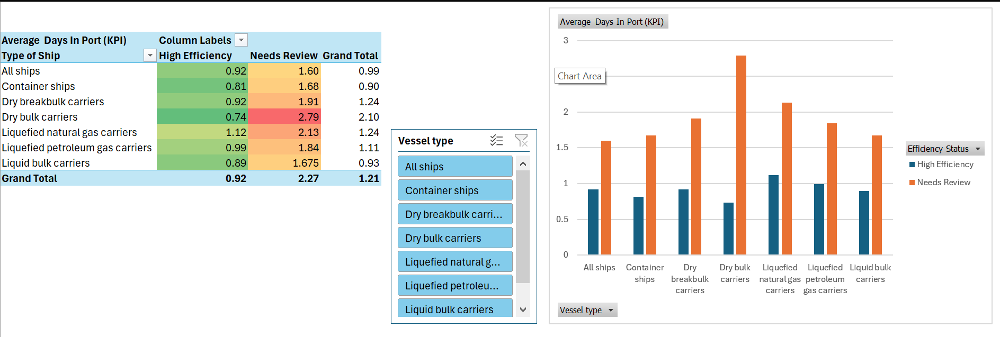

# Maritime Port Performance Analysis
# Project Overview

This project analyzes global maritime port efficiency using a dataset of over 700 port records. As a BBIT professional, i developed this tool to help port authorities like KPA identify operational bottlenecks.
# Key Features 
 • Automated Efficiency Logic: Used excel formulas to categorize vessels into "High Efficiency" vs "Needs Review" based on a 1.5-day turnaround KPI.

 • Interactive Dashboard: Built Pivot tables and Slicers to allow users filter performance by vessel type(e.g., All ships, Container ships) and Region.

 • Data Cleaning: Processed raw data(CSV), handled missing DWT values, and standardized numerical formats for management reporting.
# Tools Used 
 • Microsoft Excel(Advanced Pivot Tables, Logical Formulas, Data Modeling)

 • Data Cleaning & Transformation
